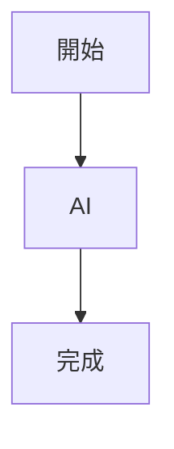

AI 不只會寫 Markdown，幾乎所有 AI 工具都偏好 Markdown。

如果你想建立自己的知識庫、Prompt、Cursor Rules、Claude Code、SOP 或文件系統，Markdown 幾乎是必學技能。

## 為什麼要學 Markdown？

Markdown 是一種輕量級標記語言（Lightweight Markup Language）。

它的特色：

- 容易閱讀
- 容易撰寫
- 不依賴特定軟體
- 幾乎所有 AI 工具都支援

目前常見的平台都大量使用 Markdown，例如：

- GitHub
- Notion
- Obsidian
- Cursor
- Claude Code
- ChatGPT Projects
- Hugo
- VS Code

## 基本語法

### 標題

````markdown
# H1

## H2

### H3

#### H4

##### H5

###### H6
````

效果：

# 第一層

## 第二層

### 第三層

### 粗體

````markdown
**粗體**
````

效果：

**粗體**

### 斜體

````markdown
*斜體*
````

效果：

*斜體*

### 粗斜體

````markdown
***粗斜體***
````

效果：

***粗斜體***

### 刪除線

````markdown
~~刪除~~
````

效果：

~~刪除~~

## 清單

### 無序清單

````markdown
- Apple
- Banana
- Orange
````

效果：

- Apple
- Banana
- Orange

### 巢狀清單

````markdown
- AI
  - ChatGPT
  - Claude
  - Gemini
````

效果：

- AI
  - ChatGPT
  - Claude
  - Gemini

### 有序清單

````markdown
1. 第一項
2. 第二項
3. 第三項
````

效果：

1. 第一項
2. 第二項
3. 第三項

## 引用

````markdown
> AI 不會取代你
> 但會使用 AI 的人可能會。
````

效果：

> AI 不會取代你
> 但會使用 AI 的人可能會。

## 程式碼

### 行內程式碼

````markdown
使用 `Ctrl+C`
````

效果：

使用 `Ctrl+C`

### 程式區塊

`````markdown
```python
print("Hello")
```
`````

效果：

```python
print("Hello")
```

## 超連結

````markdown
[ContextLab](https://contextlab.tw)
````

效果：

[ContextLab](https://contextlab.tw)

## 圖片

````markdown

````

## 水平線

````markdown
---
````

效果：

---

## 表格

````markdown
| 名稱 | 說明 |
|------|------|
| ChatGPT | AI |
| Claude | AI |
| Gemini | AI |
````

效果：

| 名稱 | 說明 |
|------|------|
| ChatGPT | AI |
| Claude | AI |
| Gemini | AI |

## Task List

````markdown
- [ ] 尚未完成
- [x] 已完成
````

效果：

- [ ] 尚未完成
- [x] 已完成

## Emoji

````markdown
🚀
📚
🤖
💡
````

效果：

🚀 📚 🤖 💡

## HTML

Markdown 可以直接使用 HTML。

例如：

````html
<details>
  <summary>點我展開</summary>
  內容
</details>
````

效果（支援的平台）：

<details>
  <summary>點我展開</summary>
  內容
</details>

## Mermaid 流程圖

很多 AI 工具都支援 Mermaid。

`````markdown

`````

## 數學公式（LaTeX）

````latex
$$
E = mc^2
$$
````

## Hugo 常用 Front Matter

如果你的網站使用 Hugo，每篇文章前面通常會有：

````yaml
---
title: "Markdown 完整指南"
date: 2026-04-13
tags:
  - Markdown
  - AI
categories:
  - AI 基礎
draft: false
---
````

## AI 時代最常用的 Markdown 檔案

| 檔案 | 用途 |
|------|------|
| README.md | 專案介紹 |
| CHANGELOG.md | 更新紀錄 |
| TODO.md | 待辦事項 |
| SOP.md | 作業流程 |
| Prompt.md | Prompt 管理 |
| Cursor Rules (.mdc) | Cursor 規則 |
| CLAUDE.md | Claude Code 專案設定 |
| AGENTS.md | AI Agent 說明 |
| CONTRIBUTING.md | 協作規範 |
| LICENSE.md | 授權條款 |

## 我最常使用 Markdown 的地方

以目前 ContextLab 的知識管理架構，我幾乎所有 AI 相關內容都採用 Markdown，例如：

- AI Workflow
- Cursor Rules
- Claude Code
- Prompt Library
- Agent 設計文件
- SOP
- MCP 文件
- Context Engineering
- 技術筆記
- GitHub 專案
- Hugo 網站文章
- AI 知識庫

Markdown 已不只是文件格式，而是 AI 與知識管理的共同語言。

## 結語

在 AI 時代，Word 是給人閱讀的；Markdown 則是給人與 AI 一起協作的。

當你的知識開始以 Markdown 累積，你可以更容易將內容同步到 GitHub、Hugo、Notion、Cursor、Claude Code，以及各種 AI Agent，建立可持續演進的企業知識系統。
